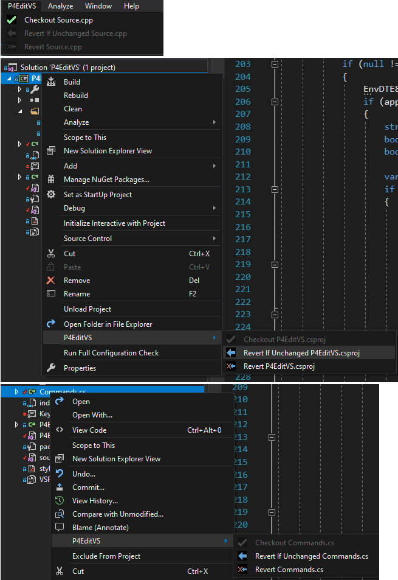

# P4EditVS

Simple, lightweight Visual Studio extension that allows you to checkout and revert files in Perforce without slowing down or blocking your IDE. 

# Configuration

Visit `Tools` > `Options`, `P4EditVS` section.

Specify client, server and user names for up to 6 workspaces. Any
workspaces configured here will show up in the `P4EditVS` menu, so you
can switch between them easily.

Set `Allow Environment` to `True` to enable a 7th workspace in the
`P4EditVS` menu - `(Use environment)`. When selected, this runs `p4`
with no additional parameters. You just get whatever settings are set
with `p4 set` and/or `Connection` > `Environment Settings...` in p4v.

The selected workspace is saved in the suo file for each solution.

# Supported Commands

* Checkout
* Revert
* Revert If Unchanged
* History
* Diff Against Have Revision
* Time-lapse View
* Revision Graph

# Notes

* p4.exe must be accessible from PATH for checkout/revert.
* p4v.exe must be accessible from PATH for history/diff/timelapse view/revision graph.
* Up to 6 workspace settings supported.
* The extension does not send or collect any information, settings are only stored locally. 
* This extension silently fails as it does not receive any information from the Perforce server, it only issues commands to it.
* Checkout/revert state is only determined by file read-only flag.
* For more advanced functionality see the offical P4VS extension.
* `(Use environment)` is not much use with p4config files, as p4 is
  not run from the file's folder. This may or may not improve.
